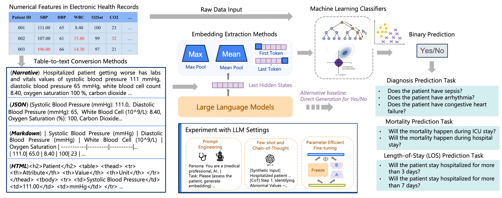

# LLM Embedding for Medical Machine Learning Applications

This repository contains the source code and supplementary materials for our EMNLP Findings 2024 paper:

**[When Raw Data Prevails: Are Large Language Model Embeddings Effective in Numerical Data Representation for Medical Machine Learning Applications?](https://aclanthology.org/2024.findings-emnlp.311/)**

## Overview




The paper investigates the effectiveness of large language model (LLM) embeddings in representing numerical data from electronic health records (EHRs) for medical diagnostics and prognostics. We evaluate the utility of LLM-derived embeddings as features for machine learning classifiers in tasks like diagnosis prediction, mortality prediction, and length-of-stay prediction. Our findings highlight:

- **Raw data features dominate** medical ML tasks, but LLM embeddings demonstrate competitive performance in some cases.
- LLM embeddings are robust across tasks and settings, providing an alternative to raw data for certain applications.
- This work emphasizes the potential of LLMs for medical applications and identifies challenges in their current use.

## Features

- **Table-to-Text Conversion:** Scripts to transform tabular EHR data into formats like narratives and JSON for LLM input.
- **Embedding Classifiers:** Pipelines to train and evaluate ML classifiers using embeddings extracted from the last hidden states of LLMs.
- **XGB Baseline:** Implementation of XGBoost models using raw numerical EHR data as input for baseline comparison.

## Repository Structure

- `table_to_text_conversion.py`: Converts tabular EHR data into narrative or structured text formats.
- `embedding_classifiers.py`: Extracts embeddings from LLMs and trains classifiers.
- `xgb_baseline.py`: Implements the XGBoost baseline using raw numerical features.


## Getting Started

### Prerequisites

- Python 3.8 or higher
- Required libraries (install via `requirements.txt`):
  ```bash
  pip install -r requirements.txt

 ## Citation
If you use our code, please cite our paper:

`` Yanjun Gao, Skatje Myers, Shan Chen, Dmitriy Dligach, Timothy A Miller, Danielle Bitterman, Matthew Churpek, and Majid Afshar. 2024. When Raw Data Prevails: Are Large Language Model Embeddings Effective in Numerical Data Representation for Medical Machine Learning Applications?. In Findings of the Association for Computational Linguistics: EMNLP 2024, pages 5414–5428, Miami, Florida, USA. Association for Computational Linguistics.`` 

Or use the following BibTeX:
``
@inproceedings{gao-etal-2024-raw,
    title = "When Raw Data Prevails: Are Large Language Model Embeddings Effective in Numerical Data Representation for Medical Machine Learning Applications?",
    author = "Gao, Yanjun  and
      Myers, Skatje  and
      Chen, Shan  and
      Dligach, Dmitriy  and
      Miller, Timothy A  and
      Bitterman, Danielle  and
      Churpek, Matthew  and
      Afshar, Majid",
    editor = "Al-Onaizan, Yaser  and
      Bansal, Mohit  and
      Chen, Yun-Nung",
    booktitle = "Findings of the Association for Computational Linguistics: EMNLP 2024",
    month = nov,
    year = "2024",
    address = "Miami, Florida, USA",
    publisher = "Association for Computational Linguistics",
    url = "https://aclanthology.org/2024.findings-emnlp.311",
    pages = "5414--5428",
    abstract = "The introduction of Large Language Models (LLMs) has advanced data representation and analysis, bringing significant progress in their use for medical questions and answering. Despite these advancements, integrating tabular data, especially numerical data pivotal in clinical contexts, into LLM paradigms has not been thoroughly explored. In this study, we examine the effectiveness of vector representations from last hidden states of LLMs for medical diagnostics and prognostics using electronic health record (EHR) data. We compare the performance of these embeddings with that of raw numerical EHR data when used as feature inputs to traditional machine learning (ML) algorithms that excel at tabular data learning, such as eXtreme Gradient Boosting. We focus on instruction-tuned LLMs in a zero-shot setting to represent abnormal physiological data and evaluating their utilities as feature extractors to enhance ML classifiers for predicting diagnoses, length of stay, and mortality. Furthermore, we examine prompt engineering techniques on zero-shot and few-shot LLM embeddings to measure their impact comprehensively. Although findings suggest the raw data features still prevail in medical ML tasks, zero-shot LLM embeddings demonstrate competitive results, suggesting a promising avenue for future research in medical applications.",
}
``

